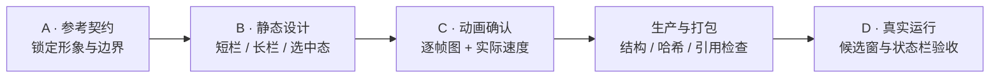

<p align="center">
  
</p>

<h1 align="center">Sogou Skin Maker Skill</h1>

<p align="center">
  <strong>把“帮我做个搜狗皮肤”，变成一套能确认、能复现、能装机检查的工作流。</strong>
</p>

<p align="center">
  <a href="https://github.com/sink0216/sogou-skin-maker-skill/actions/workflows/validate.yml"></a>
  <a href="LICENSE"></a>
  
  
</p>

> 参考图看懂了，装进输入法却全变样？人物被拉伸、候选词挤歪、动画眨眼像抽搐、旧母包删了以后只能重做……这类坑，本 Skill 都踩过，也都写进流程里了。

这是一个面向 Codex 的搜狗输入法皮肤制作 Skill。它不只负责“画一张好看的图”，还会把参考确认、平台分流、资源去重、动画审核、打包验证和真实运行检查串成完整闭环。

## 为什么值得收藏

| 你最容易卡住的地方 | Skill 会怎么做 |
|---|---|
| **参考图和成品不是一个画风** | 先建立 `必须保留 / 可以调整 / 禁止引入` 契约，确认后才开始画 |
| **候选窗越改越高、人物还被拉伸** | 把背景、文字布局、人物图层和控件占位分开测量，不用一张大图糊过去 |
| **眨眼、跑动做出来总有残影** | 固定一个母版，只改指定像素；同时检查实际速度和逐帧放大图 |
| **旧皮肤文件找不到，又被要求重传** | 先搜本地母包、解包目录、构建产物和哈希记录；能重建就不再索要 |
| **预览没问题，装机却翻车** | 把预览批准和运行时批准分开；最终以真实搜狗候选窗为准 |

## 一张图到可安装皮肤，要过四道门



任何上游设计变化都会重新打开对应确认门。不会拿一句“看着差不多”直接覆盖你已经确认的部分。

## 它能做什么

### 01｜设计不是“凭感觉”

- 拆分形象、构图、配色、装饰和动画参考
- 同时展示短候选、五候选、长候选与非首项选中状态
- 检查浅色/深色背景、固定区和拉伸区
- 明确哪些素材必须原样保留，哪些只作为格式参考

### 02｜动画不是“多画几帧”

- 支持静态皮肤与 APNG 动画
- 记录帧数、位移、锚点、停留时间和循环方式
- 候选窗人物、陪伴物、状态栏、星星与控件分别管理
- 同时输出实际速度预览与放大逐帧检查

### 03｜工程不是“改个后缀”

- macOS `.mssf`：检查双层 ZIP、`skin.plist`、1x/2x 与通知配置
- Windows 经典 `.ssf`：检查 `skin.ini` 编码、扁平包结构、图层与控件状态
- 只允许预期成员发生变化，其余资源尽量保持字节一致
- 校验 CRC、图片引用、APNG 时序、画布、透明边界和构建哈希

## 30 秒安装

```bash
git clone https://github.com/sink0216/sogou-skin-maker-skill.git
mkdir -p ~/.codex/skills
cp -R sogou-skin-maker-skill/skill/sogou-macos-skin-maker ~/.codex/skills/
```

重新打开 Codex，然后直接说：

```text
$sogou-macos-skin-maker 参考这张图，帮我设计一款 Windows 搜狗输入法皮肤
```

也可以从这些任务开始：

<details>
<summary><strong>修复一款越改越奇怪的旧皮肤</strong></summary>

```text
$sogou-macos-skin-maker 检查这个皮肤的候选窗布局。不要改变原有样式，只修复人物拉伸和上下 padding。
```

</details>

<details>
<summary><strong>给已经确认的皮肤增加动画</strong></summary>

```text
$sogou-macos-skin-maker 保持静态设计不变，为左侧角色设计自然眨眼，并给右侧陪伴物增加原地跑动。
```

</details>

<details>
<summary><strong>只研究格式，不继承旧设计</strong></summary>

```text
$sogou-macos-skin-maker 这个文件只用于参考包结构，不要沿用它的图、布局或颜色。
```

</details>

> Skill 的历史调用名保留为 `sogou-macos-skin-maker`，当前版本已经同时覆盖 macOS 与 Windows 经典皮肤。

## 自带的三个小工具

```text
skill/sogou-macos-skin-maker/scripts/
├── inspect_mssf.py   # 检查 macOS 双层包、图片尺寸与配置引用
├── pack_mssf.py      # 确定性打包 .mssf
└── apng_tool.py      # 检查或组装全画布 APNG
```

工具脚本仅依赖 Python 标准库。仓库测试：

```bash
python3 -m unittest discover -s tests -v
```

## 安全边界

- 不附带任何成品 `.ssf` / `.mssf`
- 不附带角色图片、用户素材或专有参考皮肤
- 不会跨用户复用私有文件
- 不会为了研究格式，反复要求用户提供同一份皮肤
- 不会凭空伪造 Windows H5/现代皮肤格式
- 没有真实运行截图时，不会把“打包成功”说成“实机验收通过”

## 仓库结构

```text
skill/sogou-macos-skin-maker/
├── SKILL.md
├── agents/openai.yaml
├── references/
└── scripts/
```

想补充新的格式检查、失败案例或运行时经验？欢迎阅读 [CONTRIBUTING.md](CONTRIBUTING.md)。但请不要提交成品皮肤、第三方美术或用户私有文件。

如果它替你少走了一次“越改越怪”的弯路，点个 Star 就够了。

<sub>封面为本项目原创概念示意，不代表仓库附带成品皮肤。代码和文档采用 <a href="LICENSE">MIT License</a>；搜狗输入法及相关商标属于相应权利人，本项目与搜狗官方无关联。详见 <a href="NOTICE.md">NOTICE</a>。</sub>
