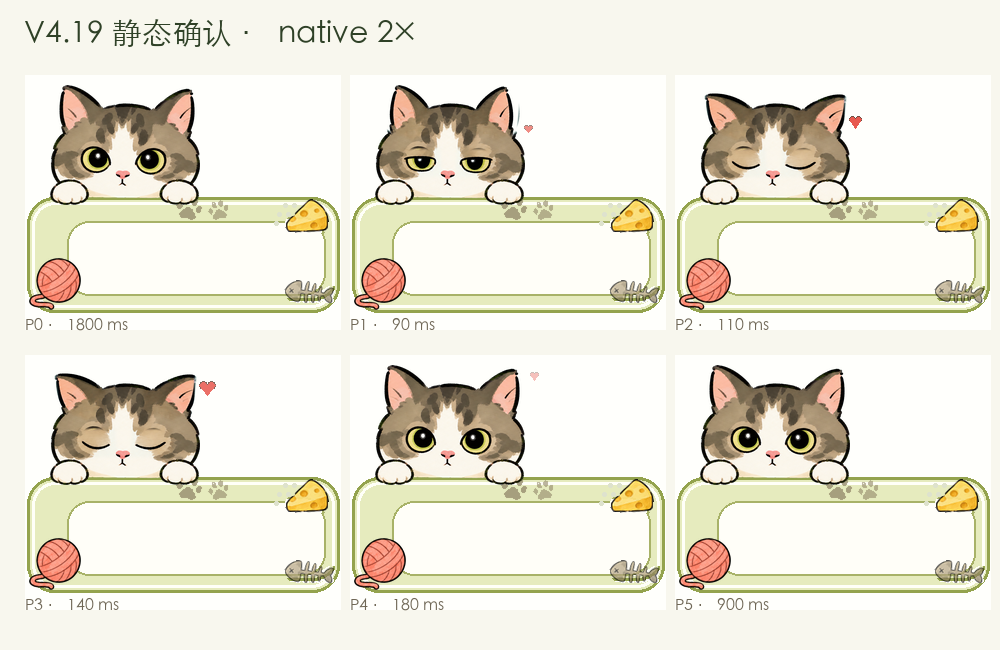

# Sogou Skin Maker Skill

[](https://github.com/sink0216/sogou-skin-maker-skill/actions/workflows/validate.yml)
[](LICENSE)

制作这个 Skill 的初衷，是在为我家去世的宠物猫制作 Codex 桌宠后，我突然想试一试：是不是也可以用 Codex 制作一款输入法皮肤？没想到真的可以落地。

于是我就把这次制作过程总结为 Skill，希望能够帮助到其他需要的朋友。

下面是目前的“猫咪陪你打字”v4.19：



支持 macOS `.mssf` 和 Windows 经典 `.ssf`。

## 它能做什么

给 Codex 一张参考图，或者只写一句描述。它会先做静态设计稿，确认角色、构图和候选窗状态，再拆资源、做动画和打包。安装后还要用真实候选窗截图调最后一轮。

可以拿它来：

- 根据宠物照片设计一款新皮肤
- 保留指定角色的身份和原有画风，重新安排候选窗
- 只有文字描述时，从零设计原创主题
- 修复现有皮肤的人物拉伸、间距、锯齿或动画问题
- 把现有 `.ssf` / `.mssf` 只当格式母包，不继承它的设计

## 还能做成什么样

下面三张是制作前用的静态确认稿。它们用来确认布局，不是运行截图。

### 奶油柯基

输入：宠物照片、手绘风格参考。平台：macOS。


### 莓果洛丽塔

输入：角色参考、洛丽塔服装要求。平台：Windows。


### 极简轨道

没有参考图，提示词只有：黑白、钴蓝、轨道与节点、不要渐变。平台：Windows。


## 安装

```bash
git clone https://github.com/sink0216/sogou-skin-maker-skill.git
mkdir -p ~/.codex/skills
cp -R sogou-skin-maker-skill/skill/sogou-macos-skin-maker ~/.codex/skills/
```

重启 Codex 后就能调用。

## 怎么说

有参考图或指定角色：

```text
$sogou-macos-skin-maker 参考这张图，保留角色身份和手绘画风，为我设计一款 Windows 搜狗输入法皮肤。
```

只有文字描述：

```text
$sogou-macos-skin-maker 从零设计一款奶油柯基主题的 macOS 皮肤，手绘文具风，奶油黄与雾霾蓝配色。
```

修复已有皮肤：

```text
$sogou-macos-skin-maker 保留当前候选窗样式，只修复人物拉伸和上下 padding。
```

加动画：

```text
$sogou-macos-skin-maker 保持已确认的静态设计不变，为左侧角色增加自然眨眼动画。
```

只借用文件格式：

```text
$sogou-macos-skin-maker 这个文件只作为格式母包。保留包结构，不要沿用图片、布局和颜色。
```

## 为什么不能直接生成完就交付

搜狗皮肤不是一张改了后缀名的 PNG。候选窗会横向拉伸，里面还有拼音、候选词、选中态、翻页按钮和点击区。Windows 和 macOS 的配置与打包方式也不同。

实际制作时会检查这些内容：

- 短候选、五候选、长候选，以及首项和非首项选中
- 人物、候选框、状态栏和拉伸区是否真的分开
- 1x / 2x PNG 与 APNG 的尺寸、清晰度和帧序
- 配置编码、图片引用、包结构和打包前后的成员变化
- 安装后的 padding、锚点、控件占位和点击区域

修一个局部问题时，无关资源会先锁住。比如只改候选词上方的 3 px，就不该顺手把人物、颜色和边框一起重做。

## 制作流程

| 阶段 | 检查什么 |
|---|---|
| Gate A | 哪些参考必须保留，哪些只能借格式 |
| Gate B | 短栏、长栏、选中态、人物位置和翻页控件 |
| Gate C | 动哪里、怎么动、多久动一次 |
| Gate D | 安装皮肤，用真实候选窗截图校准 |

前三个阶段要由用户确认。设计改了，对应的阶段就重新确认，不能拿旧的“可以”继续往下做。

## 支持的格式

| 平台 | 格式 | 配置 | 包结构 | 状态 |
|---|---|---|---|---|
| macOS | `.mssf` | `skin.plist` | 外层 ZIP 仅含 `Skin`，`Skin` 为内层 ZIP | 支持 |
| Windows | 经典 `.ssf` | 通常为 UTF-16LE+BOM `skin.ini` | 以实际母包为准，常见为扁平 ZIP | 支持 |
| Windows | H5 / 现代格式 | 未固定 | 需要官方 schema 或可运行样本 | 不推测 |

macOS 和 Windows 用的不是同一套规则。目标平台没确认前，不会拿 plist 的参数去猜 Windows 配置。

## 仓库里的工具

三个脚本只依赖 Python 标准库：

```text
skill/sogou-macos-skin-maker/scripts/
├── inspect_mssf.py  # 检查双层包、plist、图片尺寸、APNG 和资源引用
├── pack_mssf.py     # 按固定文件顺序和时间戳打包 .mssf
└── apng_tool.py     # 检查或组装全画布 APNG
```

检查 macOS 包：

```bash
python3 skill/sogou-macos-skin-maker/scripts/inspect_mssf.py skin.mssf --json
```

打包 macOS 皮肤：

```bash
python3 skill/sogou-macos-skin-maker/scripts/pack_mssf.py path/to/Skin output.mssf
```

检查 APNG：

```bash
python3 skill/sogou-macos-skin-maker/scripts/apng_tool.py inspect animation.png
```

## 测试

```bash
python3 -m unittest discover -s tests -v
```

测试内容包括 Skill 元数据、公开安全规则、Python 语法、`.mssf` 打包往返和 APNG 组装往返。

## 仓库结构

```text
skill/sogou-macos-skin-maker/
├── SKILL.md
├── agents/openai.yaml
├── references/
│   ├── design-approval-playbook.md
│   ├── format-map.md
│   ├── official-gallery-study.md
│   ├── qa-playbook.md
│   └── windows-classic-ssf.md
└── scripts/

docs/demo/                  # README 使用的原创设计示例
```

仓库不包含可安装的 `.ssf` / `.mssf`、用户私有素材或专有参考皮肤。使用指定角色或参考图时，请确认自己有权使用相关素材。

Skill 会先搜索当前环境里已有的皮肤和历史构建记录，不会反复要求用户提供同一个文件，也不会跨用户复用私有文件。

## License

代码和文档采用 [MIT License](LICENSE)。搜狗输入法及相关商标属于相应权利人；本项目与搜狗官方无关联。参见 [NOTICE.md](NOTICE.md)。
