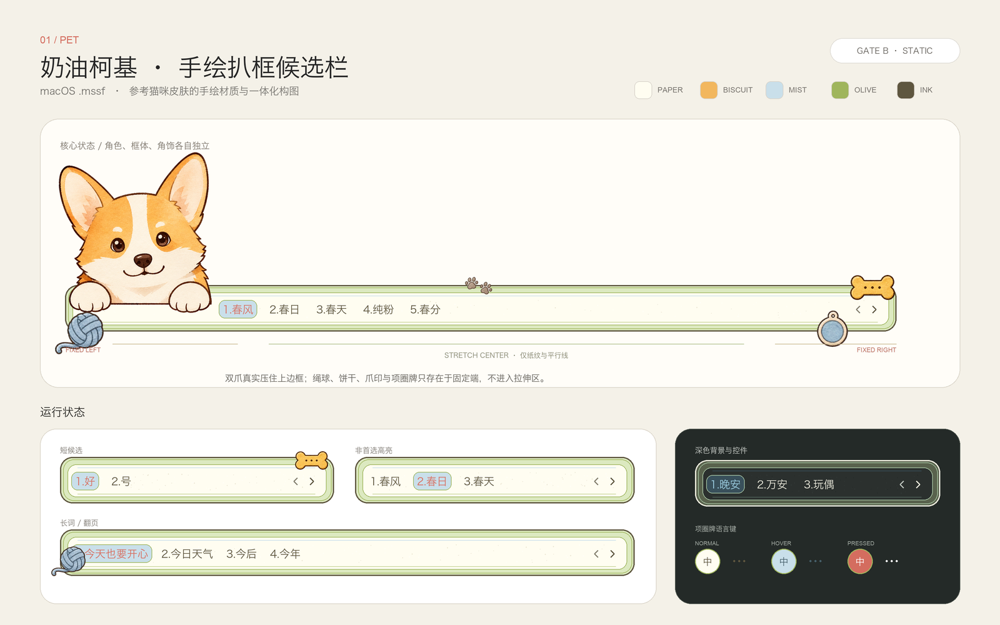
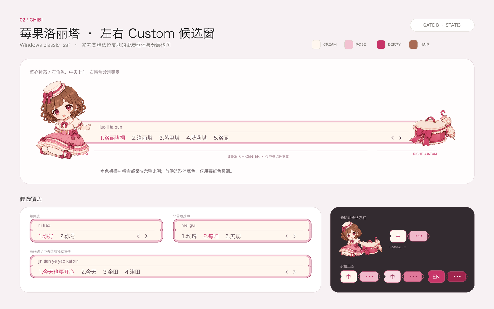
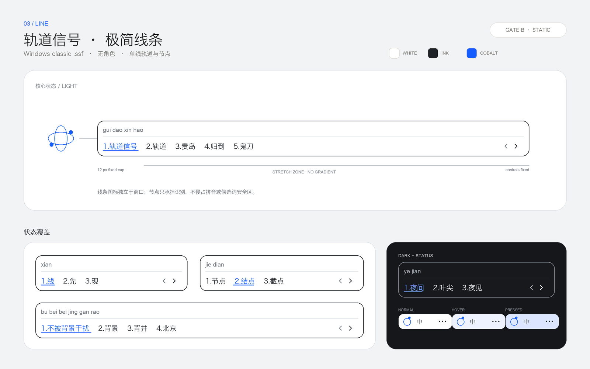

# Sogou Skin Maker Skill

[](https://github.com/sink0216/sogou-skin-maker-skill/actions/workflows/validate.yml)
[](LICENSE)

把自推、自家宠物，或者自己写的角色做成搜狗输入法皮肤，让它们待在候选窗边上。

给 Codex 一张参考图，或者只写一句描述。Skill 负责设计稿、资源拆分、动画、打包和上机校准。支持 macOS `.mssf` 和 Windows 经典 `.ssf`。

这个项目是从一款艾雅法拉皮肤里长出来的。那款皮肤前后改了很多轮：人物被候选窗拉长，padding 调好了又被改坏，眨眼像突然换了一张脸。最后我们把这些坑和解决办法整理成了这个 Skill。

## 看图

下面是制作时用的静态确认稿。实际安装后还会再检查候选窗，不拿设计图冒充运行截图。

### 奶油柯基

输入：宠物照片、手绘风格参考。平台：macOS。



### 莓果洛丽塔

输入：角色参考、洛丽塔服装要求。平台：Windows。



### 极简轨道

没有参考图，只有一句提示词：黑白、钴蓝、轨道与节点、不要渐变。平台：Windows。



## 安装

```bash
git clone https://github.com/sink0216/sogou-skin-maker-skill.git
mkdir -p ~/.codex/skills
cp -R sogou-skin-maker-skill/skill/sogou-macos-skin-maker ~/.codex/skills/
```

重启 Codex 后就能调用。

## 用法

有参考图或指定角色：

```text
$sogou-macos-skin-maker 参考这张图，保留角色身份和手绘画风，为我设计一款 Windows 搜狗输入法皮肤。
```

只有文本提示词：

```text
$sogou-macos-skin-maker 从零设计一款奶油柯基主题的 macOS 皮肤，手绘文具风，奶油黄与雾霾蓝配色。
```

已有皮肤，只想修问题：

```text
$sogou-macos-skin-maker 保留当前候选窗样式，只修复人物拉伸和上下 padding。
```

想加动画：

```text
$sogou-macos-skin-maker 保持已确认的静态设计不变，为左侧角色增加自然眨眼动画。
```

现有文件只拿来当格式母包：

```text
$sogou-macos-skin-maker 这个文件只作为格式母包。保留包结构，不要沿用图片、布局和颜色。
```

## 搜狗皮肤不是一张 PNG

候选窗会横向拉伸，还有拼音、候选词、选中态、翻页按钮和点击区。设计稿看着没问题，装进去以后照样可能拉坏。

Skill 会检查：

- 搜索并按 SHA-256 去重本地母包、解包目录和构建产物
- 区分格式参考、视觉参考、精确素材和动作参考
- 检查短候选、五候选、长候选、首项和非首项选中
- 拆分角色、候选框、状态栏和拉伸区，避免互相污染
- 生成并检查 1x/2x PNG 与 APNG
- 检查配置编码、图片引用、包结构和变更成员
- 安装后用真实候选窗截图校准 padding、锚点和控件占位
- 修复局部问题时锁定无关资源，避免越改越歪

## 流程

| 阶段 | 检查什么 |
|---|---|
| Gate A | 哪些参考必须保留，哪些只能借格式 |
| Gate B | 短栏、长栏、选中态、人物位置和翻页控件 |
| Gate C | 动哪里、怎么动、多久动一次 |
| Gate D | 安装皮肤，用真实候选窗截图校准 |

前三个阶段要由用户确认。设计一旦改了，相关阶段重新确认，不能拿旧的“可以”继续往下做。

## 格式支持

| 平台 | 格式 | 配置 | 包结构 | 状态 |
|---|---|---|---|---|
| macOS | `.mssf` | `skin.plist` | 外层 ZIP 仅含 `Skin`，`Skin` 为内层 ZIP | 支持 |
| Windows | 经典 `.ssf` | 通常为 UTF-16LE+BOM `skin.ini` | 以实际母包为准，常见为扁平 ZIP | 支持 |
| Windows | H5 / 现代格式 | 未固定 | 需要官方 schema 或可运行样本 | 不推测 |

macOS 和 Windows 使用不同的配置、资源和打包规则。Skill 会先判断平台，不会拿 macOS 的 plist 规则硬套 Windows。

## 自带工具

三个脚本只依赖 Python 标准库：

```text
skill/sogou-macos-skin-maker/scripts/
├── inspect_mssf.py  # 检查双层包、plist、图片尺寸、APNG 和资源引用
├── pack_mssf.py     # 按固定文件顺序和时间戳打包 .mssf
└── apng_tool.py     # 检查或组装全画布 APNG
```

检查 macOS 包：

```bash
python3 skill/sogou-macos-skin-maker/scripts/inspect_mssf.py skin.mssf --json
```

打包 macOS 皮肤：

```bash
python3 skill/sogou-macos-skin-maker/scripts/pack_mssf.py path/to/Skin output.mssf
```

检查 APNG：

```bash
python3 skill/sogou-macos-skin-maker/scripts/apng_tool.py inspect animation.png
```

## 验证

仓库测试会检查 Skill 元数据、公开安全规则、Python 语法、`.mssf` 打包往返和 APNG 组装往返。

```bash
python3 -m unittest discover -s tests -v
```

## 仓库结构

```text
skill/sogou-macos-skin-maker/
├── SKILL.md
├── agents/openai.yaml
├── references/
│   ├── design-approval-playbook.md
│   ├── format-map.md
│   ├── official-gallery-study.md
│   ├── qa-playbook.md
│   └── windows-classic-ssf.md
└── scripts/

docs/demo/                  # README 使用的原创静态设计示例
```

仓库不包含成品 `.ssf`/`.mssf`、用户私有素材或专有参考皮肤。`docs/demo/` 只保存本项目生成的原创静态概念图。使用指定角色或参考图时，请确认自己有权使用相关素材。

本 Skill 会先搜索当前环境中已经存在的皮肤和历史构建记录，不会反复要求用户提供同一个文件，也不会跨用户复用私有文件。

## License

代码和文档采用 [MIT License](LICENSE)。搜狗输入法及相关商标属于相应权利人；本项目与搜狗官方无关联。参见 [NOTICE.md](NOTICE.md)。
